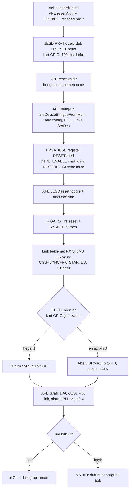

# AFE7900 + JESD204C saha testi (sirket karti) - adim adim

Bu kilavuz, Spec2Code'un urettigi AFE7900 surucusunu ve JESD204C baglanti katmanini gercek
AFE7900 kartinda (ZCU102/ZCU111 + jesd204_phy ya da musteri karti) denemek icin gereken her seyi
tek yerde toplar. KV260'ta dogrulanmis olanlar ve sahada ilk kez calisacak varsayimlar ayri isaretlidir.

## 1. Onkosullar

- Vivado/Vitis **2023.2** (klasik BSP akisi, `bsp_flow: classic`). JESD204C IP lisansi (eval ya da tam).
- XSA: `xilinx.com:ip:jesd204c` RX ve/veya TX (XSA'dan `register_map: jesd204c`, `C_ENCODING`,
  `C_LANES`, alt sinif otomatik okunur), PS SPI (XSpiPs) ya da AXI Quad SPI (XSpi) - AFE'nin CS'i,
  istege bagli **SYSREF AXI GPIO** (id ya da instance adinda `sysref` gecen 1-bit cikis GPIO; bit0 -> her
  iki cekirdegin `*_sysref` girisi). SYSREF saat agacindan (LMK) geliyorsa GPIO gerekmez.
- Latte'den alinmis AFE config hex dosyasi: satir basina bir `0x11223344,` sozcugu (8-9k satir).
- Ethernet ajani icin PS GEM (KV260'ta dogrulanan yol) ya da UART ajani.

## 2. Spec2Code'da proje kurulumu

1. Setup: XSA'yi yukle; platform Zynq UltraScale+, `bsp_flow` klasik, transport Ethernet (agin
   `testbench_network` alanlari: kart IP/mask/gateway/MAC, port 5000) ya da UART.
2. Schematic: katalogdan **AFE7900** ekle, SPI denetleyicisine bagla, `spi_chip_select`'i gir.
   Cihaz ayarinda **"AFE config (Latte hex)"** alanina Latte ciktisini yapistir (rozet sozcuk sayisini
   gosterir), TI log seviyesi (0 ERROR ... 4 DEBUG) ve TDD override (varsayilan acik: rx=15, fb=0, tx=15) sec.
3. Generate: QC 0 hata beklenir. Ciktilar:
   - `drivers/afe7900.c/.h` (surucu), `drivers/afe7900_config.c` (Latte dizisi),
   - `drivers/vendor/afe79xx/` (TI C API v2.9 aynen + uretilen `tiAfe79_baseFunc.c` HAL koprusu),
   - `drivers/ip/jesdlink.c/.h` (JESD204C cekirdek reset/durum/SYSREF; XSA kodlamasina gore tek akis),
   - `tests/<proje>_testbench_ops.c` (ajan op'lari), `tests/spec2code_testbench_manifest.json`.
4. Vitis: "Sifirdan kur" - workspace betigi TI kodu icin `libm`'i ve lwIP PHY autoneg 30 s yamasini
   kendisi ekler. Ajan ELF + shell ELF uretilir.
5. **Kart kontrol GPIO'su** (Setup, "Kart kontrol GPIO" karti): XSA'daki dual-channel AXI GPIO'yu sec (kanal 1
   cikis, kanal 2 giris) ve kartin sematigindeki bitleri tabloya gir: `afe1_reset_active_low` (afe_reset,
   aktif-dusuk), `jesd_afe1_rx/tx_core_reset_active_high` (jesd_rx/tx_core_reset), `afe1_hsclk1_lcpll_lock_0`
   gibi lock girisleri (pll_lock, hedef = AFE id + quad etiketi), varsa `sysref`. LMX/LMK bitleri `generic`
   olarak girilir, bu surumde dokunulmaz. Bit yerlesimi karttan karta degisir; tablo spec'te saklanir.

### 2.1 Bring-up akisi (AFE7900 `jesd_link_bringup` op'u)

AFE'siz `jesd` cihazinin `jesd_link_bringup` op'u ayni akisin yalniz FPGA tarafini kosar: fiziksel reset ->
register RESET -> RX link reset -> SYSREF -> link bekleme -> PLL lock -> bit0/1/5/7.

## 3. Karta yukleme

- JTAG (KV260'ta dogrulanan sira): PS init (psu_init + psu_post_config) -> **kendi pmufw.elf**
  (AMD QSPI PMUFW'si GEM DMA'yi engelliyor) -> bit -> ajan ELF. Ornek: `test/0_temp_kv260/run_post_pmufw2.tcl`.
- Host Ethernet'i ayni alt agda birden fazla arayuzdeyse baglanti kartinda **Kaynak IP**'yi kart tarafindaki
  adaptorun IP'si yap (Windows 169.254/16'yi baska arayuze yonlendirebiliyor).

## 4. Test sirasi (Test Bench ekrani, AFE7900 cihazi)

| # | Op | Beklenen | KV260'ta dogrulandi mi |
|---|----|----------|------------------------|
| 1 | `device_init` | SPI init + Latte bring-up + overrideTdd; `XST_SUCCESS` | Derleme/QC evet, gercek AFE hayir |
| 2 | `pll_lock_read` | 3 (LOCK=1, LOCK_LOST yok) | hayir |
| 3 | `health_read` | 0 (bit0 PLL, 1 DAC JESD, 2 ADC JESD, 3 SPI, 4 MCU, 5 PAP) | hayir |
| 4 | `temperature_read` | makul derece C | hayir |
| 5 | `jesd_link_bringup` | durum 0x9F (board_control lock bitleri varsa 0xBF): bit0 FPGA RX, bit1 FPGA TX, bit2 AFE DAC-JESD-RX (0xA), bit3 alarm yok, bit4 AFE PLL, bit5 kart GT PLL lock, bit7 hepsi | FPGA tarafi evet (loopback), AFE hayir |
| 6 | `jesd_link_status_read` | ayni bit yerlesimi, bekleme yok | FPGA tarafi evet |
| 7 | `jesd_rx_alarms_read` / `jesd_rx_alarms_clear` | 0 | hayir |
| 8 | `serdes_link_status_read` | tum lane'ler kilitli | hayir |
| 9 | `sysref_send`, `adc_dac_sync`, `jesd_reset_toggle` | tekrar senkron sonrasi 5-6 yeniden yesil | hayir |

Register Map ekrani: `jesd204c_rx/tx` haritalarinda RESET (bit0 seviye: 1 = ver, 0 = kaldir), STAT_STATUS
(64B/66B: bit4 SH lock, bit5 MB lock; 8B/10B: bit12 SYNC, bit13 CGS, bit14 RX started, bit15 hizalama hatasi),
lane hata sayaclari; "JESD204C link" karti FPGA-only bring-up/durum verir (AFE'siz de calisir).
Yakalama ekrani: RX ciktisini BRAM'e yazan yardimci modul (KV260 tasarimindaki gibi) varsa ham ornek + FFT.

## 5. Sahada ilk kez dogrulanacak varsayimlar (kod icinde isaretli)

1. **SPI cercevesi** (`afe7900HalSpiWrite/Read`): 24 bit = bayt0 `R/W(bit7) | adres[14:8]`, bayt1 `adres[7:0]`,
   bayt2 veri; okuma R/W=1, veri 3. baytta. TI AFE79xx SPI protokolu boyle; ilk okumada `getDeviceTemp`
   ya da chip ID'yi Register Map/`mem_read` ile kiyasla. Farkliysa `AFE7900_SPI_READ_BIT` ve bayt sirasi
   `orchestrator/afe79.py` device_unit icinde tek yerde.
2. **hostMemRead opcode akisi**: Latte hex TI'in `afeDeviceBringupFromMem` formatinda olmali (opcode 0-7,
   0x8/0x9/0xA sysparam). `breakAtPollFail=0`: poll hatasi bring-up'i durdurmaz, log'a duser (TI log seviyesi 2+).
3. **SYSREF**: `afe7900HalSysrefPulse` -> `jesdLinkSysrefPulse`: spec'te SYSREF GPIO varsa 1->0 darbesi, yoksa
   yalniz log (LMK surekli SYSREF ya da sendSysref ile AFE ic SYSREF). adcDacSync `pinSysref=1` kullanir.
4. **Bring-up sirasi**: FPGA TX/RX reset ver -> AFE init -> FPGA reset kaldir (CTRL_ENABLE cmd+data acilir)
   -> AFE jesdRx/TxFullResetToggle(3) + adcDacSync(1) -> FPGA RX link reset -> SYSREF -> RX link bekle (1 s)
   -> TX kontrol -> AFE link 0xA / alarm / PLL. Timeout'lar `jesdlink.h`: reset 200 ms, link 1000 ms.
5. **RBD**: AFE tarafi RBD optimizasyonu (`setGoodRbd`) bu surumde cagrilmaz; link kurulup veri kayarsa
   TI API `setGoodRbd(link)` eklenir (afe79.py'de hazir kalip var, op olarak acilmadi).
6. **Tek AFE**: iki AFE `S2C-CODEGEN-AFE-002` verir.

## 6. Sorun giderme

- `device_init` XST_FAILURE + log "AFE: config sozcugu yok": Latte hex girilmemis (S2C-CODEGEN-AFE-001).
- SPI okumalari hep 0x00/0xFF: CS numarasi, SPI modu (0), 24-bit cerceve; XSpiPs prescaler 8 (~ 12.5 MHz).
- FPGA RX link gelmiyor (bit0 = 0): STAT_STATUS'ta SYSREF_CAPTURED (bit1) yoksa SYSREF yolu; 64B/66B'de SH lock
  var MB lock yoksa E (multiblok) ayari (CTRL 0x2C) AFE ile ayni degil; 8B/10B'de CGS var SYNC yoksa
  ILAS/F/K parametreleri (CTRL_8B10B_CFG 0x3C) uyusmuyor.
- AFE link (bit2) yok: `getJesdRxLaneErrors`, `getJesdRxAlarms`; FPGA TX'in reset'ten cikip SYSREF yakaladigini
  (TX STAT bit1) dogrula.
- PS interconnect kilitlenmesi (ajan yanit vermez, JTAG DAP hata): bir AXI-Lite kolesi yanit vermiyor demektir;
  KV260'ta sebep tasarim scriptinde arayuz pinlerinin sabite baglanmasiydi (bkz. changelog v0.1.234).
